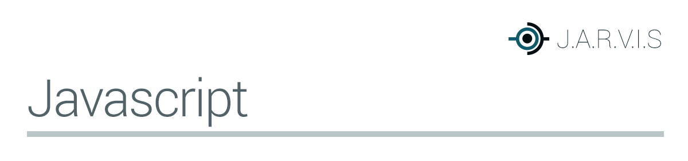

## Livros
- [Javascript Furtivo](https://leanpub.com/javascriptfurtivo/)

## Artigos
- [Programação Orientada a Objetos - Parte 01](http://pedronauck.com/programacao/programacao-orientada-objetos-oop-parte-01)
- [Programação Orientada a Objetos - Parte 02](http://pedronauck.com/programacao/programacao-orientada-objetos-oop-parte-02)
- [Programação Orientada a Objetos - Parte 03](http://pedronauck.com/programacao/programacao-orientada-objetos-oop-parte-03)
- [Sessão Javascript do Tableless](http://tableless.com.br/code/javascript/)
- [Sessão Javascript do LoopInfinito](http://loopinfinito.com.br/tag/javascript/)
- [Quero aprender Javascript. Por onde começar?](http://www.luiztiago.com/post/34760239764/quero-aprender-ou-conhecer-melhor-javascript-por-onde)
- [Criando bons construtores em JavaScript](http://jcemer.com/construtores-em-javascript.html)
- [Afinal como é orientação a Objetos em Javascript?](wbruno.com.br/javascript-puro/afinal-como-e-orientacao-a-objetos-em-javascript-exemplos/)
- [Javascript orientado a objetos](https://developer.mozilla.org/pt-PT/docs/Javascript_orientado_a_objetos)
- [JavaScript: Objetos Literais vs. Funções Construtoras](http://tableless.com.br/javascript-objetos-literais-vs-funcoes-construtoras/#.UsiOdlQ2Dsr)
- [Objetos JavaScript em Detalhe](http://javascriptbrasil.com/2013/10/07/objetos-javascript-em-detalhe/)
- [Orientação a Objetos em Javascript – Função Construtora](http://javascriptbrasil.com/2013/05/28/orientacao-a-objetos-em-javascript-funcao-construtora/)
- [Programação Funcional com Javascript](imasters.com.br/front-end/javascript/programacao-funcional-com-javascript/)

## Videos/Cursos
- [Universidade XTI - JavaScript](https://www.youtube.com/watch?v=64glGcmkHNI&list=PL48981947BAC7C172)
- [Video Eventials Boas Práticas JS (wbruno)](https://www.eventials.com/pinceladasdaweb/javascript-boas-praticas-e-otimizacoes/) e [exemplos](https://github.com/wbruno/boas-praticas-js)
- [JavaScript Idiomático (Leo Balter)](http://setemasters.imasters.com.br/conversas/javascript-idiomatico/)
- [Javascript Modular (Rafael Oliveira)](https://www.youtube.com/watch?v=HBTwzsqA3E0)
- [O fantástico mundo do JavaScript (Jean Carlo Emer)](http://www.youtube.com/watch?v=Zn7B-X0y5qs)
- [Organizando o Javascript (Nando Vieira)](https://www.youtube.com/watch?v=x9vDemjWmZQ)
